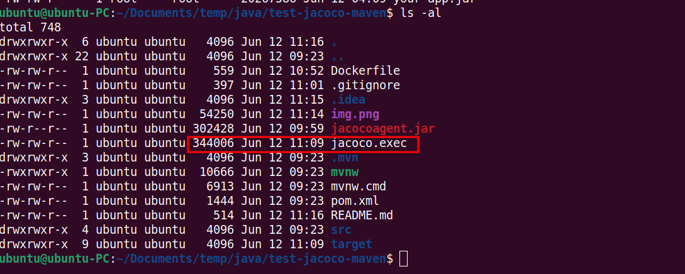
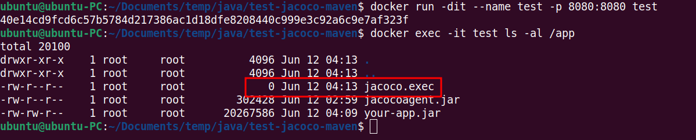

# Env 
```
Java 17
```
# Command to run
```
mvn clean package 
java -javaagent:jacocoagent.jar=destfile=jacoco.exec -jar target/*.jar
```
## Results
See **jacoco.exec** file with size > 0

## there is an issue when we run with docker
```
// build jar file
mvn clean package
docker build -t test .
docker run -dit --name test -p 8080:8080 test
// check file, the file jacoco.exec is **not** empty  (img_1.png)


// check file, the file jacoco.exec is empty (img.png)
docker exec -it test ls -al /app

```
it's empty





